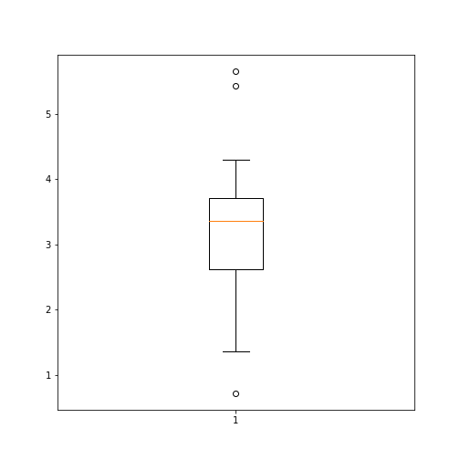

:::::::::::::::::::::::::::::::::::::: questions 

- How to use dataframes in Python?

::::::::::::::::::::::::::::::::::::::::::::::::

::::::::::::::::::::::::::::::::::::: objectives

- Import data set as dataframe
- Inspect data frame and access data
- Produce an overview of data features
- Create data plots using matplotlib
::::::::::::::::::::::::::::::::::::::::::::::::

## Video Tutorials

### Pandas Dataframes - Import and Data Handling

<p align = "center">
<iframe width="400" height="225" src="https://www.youtube.com/embed/wPiNrk6zpHc" title="YouTube video player" frameborder="0" allow="accelerometer; autoplay; clipboard-write; encrypted-media; gyroscope; picture-in-picture" allowfullscreen></iframe>
</p>

### Pandas Dataframes - Visualisation 

<p align = "center">
<iframe width="400" height="225" src="https://www.youtube.com/embed/QviydJKaSro" title="YouTube video player" frameborder="0" allow="accelerometer; autoplay; clipboard-write; encrypted-media; gyroscope; picture-in-picture" allowfullscreen></iframe>
</p>

## Introduction

This is our first lesson on learning and understanding dataframes in Python.


:::::::::::::::::::::::::::::::::::::::::::::::::::::::::::::::::::: instructor

The diabetes data set is one of the challenging task.

::::::::::::::::::::::::::::::::::::::::::::::::::::::::::::::::::::::::::::::::


## Challenge: The diabetes data set

Here is a screenshot of the so-called diabetes data set. It is taken from 
[this webpage](https://www4.stat.ncsu.edu/~boos/var.select/diabetes.tab.txt) and it is one of the [example data sets](https://scikit-learn.org/stable/modules/generated/sklearn.datasets.load_diabetes.html) used to illustrate machine learning functionality in scikit-learn (Part III and Part IV of the course). 


This figure captures only the top part of the data. On the webpage you need to scroll down considerably to view the whole content. Thus, to get an __overview__ of the dataset is the first main task in Data Science. 

::::::::::::::::::::::::::::::::::::: callout 

## The lesson

- introduces code to read and inspect the data
- works with a specific data frame and extracts some techniques to get an overview
- discusses the concept 'distribution' as a way of summarising data in a single figure


:::::::: checklist

### To get to know a dataset you need to

- access the data
- check the content
- produce a summary of basic properties

::::::::

In this lesson we will only look at univariate features where each data column is studied independently of the others. Further properties and bivariate features will be the topic of the next lesson. 

::::::::::::::::::::::::::::::::::::::::::::::::


## Work Through Example

:::::::::::::::::::::::::::::::::::::::::::::::: discussion

## Reading data into a Pandas DataFrame

The small practice data file for this section is called 'everleys_data.csv' and can be downloaded using the link given above in "Materials for this Lesson". To start, please create a subfolder called 'data' in the current directory and put the data file in it. It can now be accessed using the relative path `data/everleys_data.csv` or `data\everleys_data.csv`, respectively.

The file `everleys_data.csv` contains blood concentrations of calcium and sodium ions from 17 patients with Everley's syndrome. The data are taken from a [BMJ statistics tutorial](https://www.bmj.com/about-bmj/resources-readers/publications/statistics-square-one/7-t-tests). The data are stored as comma-separated values (csv), two values for each patient.

To get to know a dataset, we will use the Pandas package and the Matplotlib plotting. The Pandas package for data science is included in the Anaconda distribution of Python. Check this [link for installation instructions](https://pandas.pydata.org/getting_started.html) to get started. 

If you are not using the Anaconda distribution, pease refer to [these guidelines](https://pandas.pydata.org/docs/getting_started/install.html). 

To use the functions contained in Pandas they need to be imported. Our dataset is in '.csv' format, and we therefore need to read it from a csv file. For this, we import the function `read_csv`. This will create a _Pandas dataframe_.

::::::::::::::::::::::::::::::::::::::::::::::::


```python
import sys
print(sys.version)
```

```{.output}
3.10.2 (main, Feb  7 2022, 07:35:17) [GCC 9.3.0]
```


```python
from pandas import read_csv
```


Executing this code does not lead to any output on the screen. However, the function is now ready to be used. To use it, we type its name and provide the required arguments. The following code should import the Everley's data into your JupyterLab notebook (or other Python environment):


```python
# for Mac OSX and Linux
# (please go to the next cell if using Windows)

df = read_csv("data/everleys_data.csv") 
```


```python
# please uncomment for Windows
# (please go to previous cell if using Mac OSX or Linux)

# df = read_csv("data\everleys_data.csv") 

```

This code uses the `read_csv` function from Pandas to read data from a data file, in this case a file with extension '.csv'. Note that the location of the data file is specified within quotes by the relative path to the subfolder 'data' followed by the file name. Use the JupyterLab file browser to check that subfolder exists and has the file in it.


After execution of the code, the data are contained in a variable called `df`. This is a structure referred to as a Pandas _DataFrame_. 

> A [__Pandas dataframe__](https://pandas.pydata.org/pandas-docs/stable/user_guide/dsintro.html#dataframe) is a 2-dimensional labeled data structure with columns of potentially different types. You can think of it as a spreadsheet. 


To see the contents of `df`, simply use:


```python
df
```

```{.output}
     calcium      sodium
0   3.455582  112.690980
1   3.669026  125.663330
2   2.789910  105.821810
3   2.939900   98.172772
4   5.426060   97.931489
5   0.715811  120.858330
6   5.652390  112.871500
7   3.571320  112.647360
8   4.300067  132.031720
9   1.369419  118.499010
10  2.550962  117.373730
11  2.894129  134.052390
12  3.664987  105.346410
13  1.362779  123.359490
14  3.718798  125.021060
15  1.865868  112.075420
16  3.272809  117.588040
17  3.917591  101.009870
```


(Compare with the result of `print(df)` which displays the contents in a different format.) 

The output shows in the first column an index, integers from 0 to 17; and the calcium and sodium concentrations in columns 2 and 3, respectively. The default indexing starts from zero (Python is a 'zero-based' programming language).

In a dataframe, the first column is referred to as _Indices_, the first row is referred to as _Labels_. Note that the row with the labels is excluded from the row count. Similarly, the row with the indices is excluded from the column count. 


For large data sets, the function `head` is a convenient way to get a feel of the dataset.


```python
df.head()
```

```{.output}
    calcium      sodium
0  3.455582  112.690980
1  3.669026  125.663330
2  2.789910  105.821810
3  2.939900   98.172772
4  5.426060   97.931489
```


Without any input argument, this displays the first five data lines of the dataframe. You can specify alter the number of rows displayed by including a single integer as argument, e.g. `head(10)`.

If you feel there are too many decimal places in the default view, you can restrict their number by using the `round` function:


```python
df.head().round(2)
```

```{.output}
   calcium  sodium
0     3.46  112.69
1     3.67  125.66
2     2.79  105.82
3     2.94   98.17
4     5.43   97.93
```


While we can see how many rows there are in a dataframe when we display the whole data frame and look at the last index, there is a convenient way to obtain the number directly:


```python
no_rows = len(df)

print('Data frame has', no_rows, 'rows')
```

```{.output}
Data frame has 18 rows
```

You could see above, that the columns of the dataframe have labels. To see all labels:


```python
column_labels = df.columns

print(column_labels)
```

```{.output}
Index(['calcium', 'sodium'], dtype='object')
```


Now we can count the labels to obtain the number of columns:


```python
no_columns = len(column_labels)

print('Data frame has', no_columns, 'columns')
```

```{.output}
Data frame has 2 columns
```


And if you want to have both the number of the rows and the columns together, use `shape`. Shape returns a tuple of two numbers, first the number of rows, then the number of columns.


```python
df_shape = df.shape

print('Data frame has', df_shape[0], 'rows and',df_shape[1],  'columns')
```

```{.output}
Data frame has 18 rows and 2 columns
```


Notice that `shape` (like `columns`) is not followed by round parenthesis. It is not a function that can take arguments. Technically, `shape` is a 'property' of the dataframe.


To find out what data type is contained in each of the columns, us `dtypes`, another 'property':


```python
df.dtypes
```

```{.output}
calcium    float64
sodium     float64
dtype: object
```

In this case, both columns contain floating point (decimal) numbers.


:::::::::::::::::::::::: challenge

## DIY1: Read data into a dataframe
   
Download the data file 'loan_data.csv' using the link given above in "Materials for this Lesson". It contains data that can be used for the assessment of loan applications. Read the data into a DataFrame. It is best to assign it a name other than 'df' (to avoid overwriting the Evereley data set). 

Display the first ten rows of the Loan data set to see its contents. It is taken from a [tutorial on Data Handling in Python](https://www.analyticsvidhya.com/blog/2016/01/complete-tutorial-learn-data-science-python-scratch-2/) which you might find useful for further practice. 


From this exercise we can see that a dataframe can contain different types of data: real numbers (e.g. LoanAmount), integers (ApplicantIncome), categorical data (Gender), and strings (Loan_ID). 

::::::::::::::::: solution


```python
from pandas import read_csv

# dataframe from .csv file
df_loan = read_csv("data/loan_data.csv") 

# display contents
df_loan.head(10)
```

```{.output}
    Loan_ID  Gender Married  ... Loan_Amount_Term Credit_History Property_Area
0  LP001015    Male     Yes  ...            360.0            1.0         Urban
1  LP001022    Male     Yes  ...            360.0            1.0         Urban
2  LP001031    Male     Yes  ...            360.0            1.0         Urban
3  LP001035    Male     Yes  ...            360.0            NaN         Urban
4  LP001051    Male      No  ...            360.0            1.0         Urban
5  LP001054    Male     Yes  ...            360.0            1.0         Urban
6  LP001055  Female      No  ...            360.0            1.0     Semiurban
7  LP001056    Male     Yes  ...            360.0            0.0         Rural
8  LP001059    Male     Yes  ...            240.0            1.0         Urban
9  LP001067    Male      No  ...            360.0            1.0     Semiurban

[10 rows x 12 columns]
```
::::::::::::::::: 
::::::::::::::::::::::::

## Accessing data in a DataFrame

If a datafile is large and you only want to check the format of data in a specific column, you can limit the display to that column.
To access data contained in a specific column of a dataframe, we can use a similar convention as in a Python dictionary, treating the column names as 'keys'. E.g. to show all rows in column 'Calcium', use:


```python
df['calcium']
```

```{.output}
0     3.455582
1     3.669026
2     2.789910
3     2.939900
4     5.426060
5     0.715811
6     5.652390
7     3.571320
8     4.300067
9     1.369419
10    2.550962
11    2.894129
12    3.664987
13    1.362779
14    3.718798
15    1.865868
16    3.272809
17    3.917591
Name: calcium, dtype: float64
```


To access individual rows of a column we use two pairs of square brackets:


```python
df['calcium'][0:3]
```

```{.output}
0    3.455582
1    3.669026
2    2.789910
Name: calcium, dtype: float64
```

Here all rules for [slicing](https://docs.python.org/3/tutorial/introduction.html) can be applied.
As for lists and tuples, the indexing of rows is semi-inclusive, lower boundary included, upper boundary excluded.
Note that the first pair of square brackets refers to a column and the second pair refers to the rows. This is different from e.g. accessing items in a nested list.

Accessing items in a Pandas dataframe is analogous to accessing the values in a Python dictionary by referring to its keys.


To access non-contiguous elements, we use an additional pair of square brackets (as if for a list within a list):


```python
df['calcium'][[1, 3, 7]]
```

```{.output}
1    3.669026
3    2.939900
7    3.571320
Name: calcium, dtype: float64
```

Another possibility to index and slice a dataframe is the use of the 'index location' or `iloc` property. It refers first to rows and then to columns by index, all within a single pair of brackets. For example, to get all rows `:` of the first column (index `0`), you use:


```python
df.iloc[:, 0]
```

```{.output}
0     3.455582
1     3.669026
2     2.789910
3     2.939900
4     5.426060
5     0.715811
6     5.652390
7     3.571320
8     4.300067
9     1.369419
10    2.550962
11    2.894129
12    3.664987
13    1.362779
14    3.718798
15    1.865868
16    3.272809
17    3.917591
Name: calcium, dtype: float64
```

To display only the first three calcium concentrations, you use slicing, remembering that the upper bound is excluded):


```python
df.iloc[0:3, 0]
```

```{.output}
0    3.455582
1    3.669026
2    2.789910
Name: calcium, dtype: float64
```

To access non-consecutive values, we can use a pair of square brackets within the pair of square brackets: 


```python
df.iloc[[2, 4, 7], 0]
```

```{.output}
2    2.78991
4    5.42606
7    3.57132
Name: calcium, dtype: float64
```

Similarly, we can access the values from multiple columns:


```python
df.iloc[[2, 4, 7], :]
```

```{.output}
   calcium      sodium
2  2.78991  105.821810
4  5.42606   97.931489
7  3.57132  112.647360
```

To pick only the even rows from the two columns, check this colon notation:


```python
df.iloc[:18:2, :]
```

```{.output}
     calcium      sodium
0   3.455582  112.690980
2   2.789910  105.821810
4   5.426060   97.931489
6   5.652390  112.871500
8   4.300067  132.031720
10  2.550962  117.373730
12  3.664987  105.346410
14  3.718798  125.021060
16  3.272809  117.588040
```

The number after the second colon indicates the stepsize.

:::::::::::::::::::::::::::::::::: challenge

## DIY2: Select data from dataframe

Display the calcium and sodium concentrations of all patients except the first. Check the model solution at the bottom for options.

::::::::::::::::: solution


```python
df[['calcium', 'sodium']][1:]
```

```{.output}
     calcium      sodium
1   3.669026  125.663330
2   2.789910  105.821810
3   2.939900   98.172772
4   5.426060   97.931489
5   0.715811  120.858330
6   5.652390  112.871500
7   3.571320  112.647360
8   4.300067  132.031720
9   1.369419  118.499010
10  2.550962  117.373730
11  2.894129  134.052390
12  3.664987  105.346410
13  1.362779  123.359490
14  3.718798  125.021060
15  1.865868  112.075420
16  3.272809  117.588040
17  3.917591  101.009870
```

::::::::::::::::: 

:::::::::::::::::::::::::::::::::: 

Mixing the ways to access specific data in a dataframe can be confusing and needs practice.

### Search for missing values

Some tables contain missing entries. You can check a dataframe for such missing entries. If no missing entry is found, the function `isnull` will return `False`.


```python
df.isnull().any()
```

```{.output}
calcium    False
sodium     False
dtype: bool
```

This shows that there are no missing entries in our dataframe.

:::::::::::::::::::::::::::::::::: challenge
## DIY3: Find NaN in dataframe

 In the Loan data set, check the entry 'Self-employed' for ID LP001059. It shows how a missing value is represented as 'NaN' (not a number).

 Verify that the output of `isnull` in this case is `True`
 
::::::::::::::::: solution


```python
df_loan['Self_Employed'][8]
```

```{.output}
nan
```


```python
df_loan['Self_Employed'][8:9].isnull()
```

```{.output}
8    True
Name: Self_Employed, dtype: bool
```

::::::::::::::::: 

:::::::::::::::::::::::::::::::::: 

## Basic data features

### Summary Statistics

To get a summary of basic data features use the function `describe`:


```python
description = df.describe()

description
```

```{.output}
         calcium      sodium
count  18.000000   18.000000
mean    3.174301  115.167484
std     1.306652   10.756852
min     0.715811   97.931489
25%     2.610699  107.385212
50%     3.364195  115.122615
75%     3.706355  122.734200
max     5.652390  134.052390
```


The `describe` function produces a new dataframe (here called 'descrition') that contains the number of samples, the mean, the standard deviation, minimum, 25th, 50th, 75th  percentile, and the maximum value for each column of the data. Note that the indices of the rows have now been replaced by strings. To access rows, it is possible to refer to those names using the `loc` property. E.g. to access the mean of the calcium concentrations from the description, each of the following is valid:


```python
# Option 1
description.loc['mean']['calcium']

# Option 2
```

```{.output}
3.1743005405555555
```

```python
description.loc['mean'][0]

# Option 3
```

```{.output}
3.1743005405555555
```

```python
description['calcium']['mean']

# Option 4
```

```{.output}
3.1743005405555555
```

```python
description['calcium'][1]
```

```{.output}
3.1743005405555555
```


:::::::::::::::::::::::::::::::::: challenge
## DIY4: Practice

Use your own .csv data set to practice. (If you don't have a data set at hand, any excel table can be exported as .csv.) Read it into a dataframe, check its header, access indivdual values or sets of values. Create a statistics using `describe` and check for missing values using `.isnull`.

::::::::::::::::: solution
 [ad libitum]
::::::::::::::::: 

:::::::::::::::::::::::::::::::::: 

### Iterating through the columns

Now we know how to access all data in a dataframe and how to get a summary statistics over each column. 

Here is code to iterate through the columns and access the first two concentrations: 


```python
for col in df:
    
    print(df[col][0:2])
```

```{.output}
0    3.455582
1    3.669026
Name: calcium, dtype: float64
0    112.69098
1    125.66333
Name: sodium, dtype: float64
```

As a slightly more complex example, we access the median ('50%') of each column in the description and add it to a list:


```python
conc_medians = list()

for col in df:
    
    conc_medians.append(df[col].describe()['50%'])

print('The columns are: ', list(df.columns))
```

```{.output}
The columns are:  ['calcium', 'sodium']
```

```python
print('The medians are: ', conc_medians)
```

```{.output}
The medians are:  [3.3641954, 115.122615]
```

This approach is useful for data frames with a large number of columns. For instance, it is possible to then create a boxplot or histogram for the means, medians etc. of the dataframe and thus to get an overview of all (comparable) columns. 

### Selecting a subset based on a template

An analysis of a data set may need to be done on part of the data. This can often be formulated by using a logical condition which specifies the required subset.

For this we will assume that some of the data are labelled '0' and some are labelled '1'. Let us therefore see how to add a new column to our Evereleys data frame which contains the (in this case arbitrary) labels.

First we randomly create as many labels as we have rows in the data frame. We can use the `randint` function which we import from 'numpy.random'. `randint` in its simple form takes two arguments. First the upper bound of the integer needed, where by default it starts from zero. As Python is exclusive on the upper bound, providing '2' will thus yield either '0' or '1' only. 


```python
from numpy.random import randint

no_rows = len(df)

randomLabel = randint(2, size=no_rows)

print('Number of rows:  ', no_rows)
```

```{.output}
Number of rows:   18
```

```python
print('Number of Labels:', len(randomLabel))
```

```{.output}
Number of Labels: 18
```

```python
print('Labels:          ', randomLabel)
```

```{.output}
Labels:           [0 1 0 0 1 1 1 0 0 0 1 1 0 0 0 1 1 0]
```

Note how we obtain the number of rows (18) using `len` and do not put it directly into the code. 

Now we create a new data column in our `df` dataframe which contains the labels. To create a new column, you can simply refer to a column name that does not yet exist and assign values to it. Let us call it 'gender', assuming that '0' represents male and '1' represents female. 

As gender specification can include more than two labels, try to create a column with more than two randomly assigned labels e.g. (0, 1, 2).


```python
df['gender'] = randomLabel

df.head()
```

```{.output}
    calcium      sodium  gender
0  3.455582  112.690980       0
1  3.669026  125.663330       1
2  2.789910  105.821810       0
3  2.939900   98.172772       0
4  5.426060   97.931489       1
```

Now we can use the information contained in 'gender' to filter the data by gender. To achieve this, we use a conditional statement. Let us check which of the rows are labelled as '1':


```python
df['gender'] == 1
```

```{.output}
0     False
1      True
2     False
3     False
4      True
5      True
6      True
7     False
8     False
9     False
10     True
11     True
12    False
13    False
14    False
15     True
16     True
17    False
Name: gender, dtype: bool
```

If we assign the result of the conditional statement (Boolean True or False) to a variable, then this variable can act as a template to filter the data. If we call the data frame with that variable, we will only get the rows where the condition was found to be True:


```python
df_female = df['gender'] == 1

df[df_female]
```

```{.output}
     calcium      sodium  gender
1   3.669026  125.663330       1
4   5.426060   97.931489       1
5   0.715811  120.858330       1
6   5.652390  112.871500       1
10  2.550962  117.373730       1
11  2.894129  134.052390       1
15  1.865868  112.075420       1
16  3.272809  117.588040       1
```


Using the Boolean, we only pick the rows that are labelled '1' and thus get a subset of the data according to the label. 

:::::::::::::::::::::::::::::::::: challenge

## DIY5: Using a template
 
Modify the code to calculate the number of samples labelled 0 and check the number of rows of that subset.

::::::::::::::::: solution


```python
from numpy.random import randint

no_rows = len(df)

randomLabel = randint(2, size=no_rows)

df['gender'] = randomLabel

df_male = df['gender'] == 0

no_males = len(df[df_male])

print(no_males, 'samples are labelled "male".')
```

```{.output}
8 samples are labelled "male".
```
::::::::::::::::: 
::::::::::::::::::::::::::::::::::
## Visualisation of data

It is easy to see from the numbers that the concentrations of sodium are much higher than that of calcium. However, to also compare the medians, percentiles and the spread of the data it is better to use visualisation. 

The simplest way of visualisation is to use Pandas functionality which offers direct ways of plotting. Here is an example where a boxplot is created for each column:


```python
import matplotlib.pyplot as plt
df = read_csv("data/everleys_data.csv") 
plt.boxplot(df)
```

```{.output}
{'whiskers': [<matplotlib.lines.Line2D object at 0x7f75ef99b5b0>, <matplotlib.lines.Line2D object at 0x7f75ef99b880>, <matplotlib.lines.Line2D object at 0x7f75ef7909d0>, <matplotlib.lines.Line2D object at 0x7f75ef790ca0>], 'caps': [<matplotlib.lines.Line2D object at 0x7f75ef99bc10>, <matplotlib.lines.Line2D object at 0x7f75ef99be20>, <matplotlib.lines.Line2D object at 0x7f75ef790f70>, <matplotlib.lines.Line2D object at 0x7f75ef791240>], 'boxes': [<matplotlib.lines.Line2D object at 0x7f75ef99b2e0>, <matplotlib.lines.Line2D object at 0x7f75ef790700>], 'medians': [<matplotlib.lines.Line2D object at 0x7f75ef790130>, <matplotlib.lines.Line2D object at 0x7f75ef791510>], 'fliers': [<matplotlib.lines.Line2D object at 0x7f75ef790400>, <matplotlib.lines.Line2D object at 0x7f75ef7917e0>], 'means': []}
```

```python
plt.show()
```


By default, boxplots are shown for all columns if no further argument is given to the function (empty round parenthesis). As the calcium plot is rather squeezed we may wish to see it individually. This can be done by specifying the calcium column as an argument:
    


```python

# Boxplot of calcium results
# df.boxplot(column='calcium');


plt.boxplot(df['calcium'])
```

```{.output}
{'whiskers': [<matplotlib.lines.Line2D object at 0x7f75ef843160>, <matplotlib.lines.Line2D object at 0x7f75ef843310>], 'caps': [<matplotlib.lines.Line2D object at 0x7f75ef8435e0>, <matplotlib.lines.Line2D object at 0x7f75ef8438b0>], 'boxes': [<matplotlib.lines.Line2D object at 0x7f75ef842e90>], 'medians': [<matplotlib.lines.Line2D object at 0x7f75ef843b80>], 'fliers': [<matplotlib.lines.Line2D object at 0x7f75ef843e50>], 'means': []}
```

```python
plt.show()
```



### Plots using Matplotlib

> [__Matplotlib__](https://matplotlib.org) is a comprehensive library for creating static, animated, and interactive visualizations in Python.

The above is an easy way to create boxplots directly on the dataframe. It is based on the library Matplotlib and specifically uses the __pyplot library__. For simplicity, the code is put in a convenient Pandas function. 

However, we are going to use __Matplotlib__ extensively later on in the course, and we therefore now introduce the direct, generic way of using it.

For this, we import the function `subplots` from the [pyplot library](https://matplotlib.org/stable/api/pyplot_summary.html):


```python
from matplotlib.pyplot import subplots
```

The way to use `subplots` is to first set up a figure environment (below it is called 'fig') and an empty coordinate system (below called 'ax'). The plot is then done using one of the many methods available in Matplotlib. We apply it to the coordinate system 'ax'. 

As an example, let us create a [boxplot](https://matplotlib.org/api/_as_gen/matplotlib.pyplot.boxplot.html#matplotlib.pyplot.boxplot|) of the calcium variable. As an argument of the function we need to specify the data. We can use the values of the 'calcium' concentrations from the column with that name:


```python
fig, ax = subplots()

ax.boxplot(df['calcium'])
```

```{.output}
{'whiskers': [<matplotlib.lines.Line2D object at 0x7f75ed6d4100>, <matplotlib.lines.Line2D object at 0x7f75ed6d43d0>], 'caps': [<matplotlib.lines.Line2D object at 0x7f75ed6d46a0>, <matplotlib.lines.Line2D object at 0x7f75ed6d4970>], 'boxes': [<matplotlib.lines.Line2D object at 0x7f75ed69fb50>], 'medians': [<matplotlib.lines.Line2D object at 0x7f75ed6d4c40>], 'fliers': [<matplotlib.lines.Line2D object at 0x7f75ed6d4f10>], 'means': []}
```

```python
ax.set_title('Boxplot of Everley\'s Calcium');

```


Note how following the actual plot we define the title of the plot by referring to the same coordinate system `ax`.

The value of `subplots` becomes apparent when we try to create more than one plot in a single figure. 

Here is an example to create two boxplots next to each other. The keyword arguments to use is 'ncols' which is the number of figures per row. 'ncols=2' indicates that you want to have two plots next to each other. 


```python
fig, ax = subplots(ncols=2)

ax[0].boxplot(df['calcium'])
```

```{.output}
{'whiskers': [<matplotlib.lines.Line2D object at 0x7f75ef9578b0>, <matplotlib.lines.Line2D object at 0x7f75ef956860>], 'caps': [<matplotlib.lines.Line2D object at 0x7f75ef956170>, <matplotlib.lines.Line2D object at 0x7f75ef9576d0>], 'boxes': [<matplotlib.lines.Line2D object at 0x7f75ef9559f0>], 'medians': [<matplotlib.lines.Line2D object at 0x7f75ef956260>], 'fliers': [<matplotlib.lines.Line2D object at 0x7f75ef957820>], 'means': []}
```

```python
ax[0].set_title('Calcium')

ax[1].boxplot(df['sodium'])
```

```{.output}
{'whiskers': [<matplotlib.lines.Line2D object at 0x7f75ef955db0>, <matplotlib.lines.Line2D object at 0x7f75ef957610>], 'caps': [<matplotlib.lines.Line2D object at 0x7f75ef957430>, <matplotlib.lines.Line2D object at 0x7f75ef99a2f0>], 'boxes': [<matplotlib.lines.Line2D object at 0x7f75ef956020>], 'medians': [<matplotlib.lines.Line2D object at 0x7f75ef99a620>], 'fliers': [<matplotlib.lines.Line2D object at 0x7f75ef99a0e0>], 'means': []}
```

```python
ax[1].set_title('Sodium');
```


    

    


Note that you now have to refer to each of the subplots by indexing the coordinate system 'ax'. 
|
This figure gives a good overview of the Everley's data.


If you prefer to have the boxplots of both columns in a single figure, that can also be done:


```python
fig, ax = subplots(ncols=1, nrows=1)

ax.boxplot([df['calcium'], df['sodium']], positions=[1, 2])
```

```{.output}
{'whiskers': [<matplotlib.lines.Line2D object at 0x7f75ed6f8c10>, <matplotlib.lines.Line2D object at 0x7f75ed6d7bb0>, <matplotlib.lines.Line2D object at 0x7f75ed6fa2c0>, <matplotlib.lines.Line2D object at 0x7f75ed6fa590>], 'caps': [<matplotlib.lines.Line2D object at 0x7f75ed6f94b0>, <matplotlib.lines.Line2D object at 0x7f75ed6f9780>, <matplotlib.lines.Line2D object at 0x7f75ed6fa860>, <matplotlib.lines.Line2D object at 0x7f75ed6fab30>], 'boxes': [<matplotlib.lines.Line2D object at 0x7f75ed6f8f40>, <matplotlib.lines.Line2D object at 0x7f75ed6f9ff0>], 'medians': [<matplotlib.lines.Line2D object at 0x7f75ed6f9a50>, <matplotlib.lines.Line2D object at 0x7f75ed6fae00>], 'fliers': [<matplotlib.lines.Line2D object at 0x7f75ed6f9d20>, <matplotlib.lines.Line2D object at 0x7f75ed6fb0d0>], 'means': []}
```

```python
ax.set_title('Boxplot of Calcium (left) and Sodium (right)')
```


   

    

:::::::::::::::::::::::::::::: challenge
### DIY6: Boxplot from Loan data

Plot the boxplots of the 'ApplicantIncome' and the 'CoapplicantIncome' in the Loan data using the above code.

::::::::::::::::: solution


```python
fig, ax = subplots(ncols=1, nrows=1)

ax.boxplot([df_loan['ApplicantIncome'], df_loan['CoapplicantIncome']], positions=[1, 2])
```

```{.output}
{'whiskers': [<matplotlib.lines.Line2D object at 0x7f75ed570d30>, <matplotlib.lines.Line2D object at 0x7f75ed571000>, <matplotlib.lines.Line2D object at 0x7f75ed5720e0>, <matplotlib.lines.Line2D object at 0x7f75ed5723b0>], 'caps': [<matplotlib.lines.Line2D object at 0x7f75ed5712d0>, <matplotlib.lines.Line2D object at 0x7f75ed5715a0>, <matplotlib.lines.Line2D object at 0x7f75ed572680>, <matplotlib.lines.Line2D object at 0x7f75ed572950>], 'boxes': [<matplotlib.lines.Line2D object at 0x7f75ed5707c0>, <matplotlib.lines.Line2D object at 0x7f75ed571e10>], 'medians': [<matplotlib.lines.Line2D object at 0x7f75ed571870>, <matplotlib.lines.Line2D object at 0x7f75ed572c20>], 'fliers': [<matplotlib.lines.Line2D object at 0x7f75ed571b40>, <matplotlib.lines.Line2D object at 0x7f75ed572ef0>], 'means': []}
```

```python
ax.set_title('Applicant Income (left) & Co-Applicant Income (right)');
```


    

::::::::::::::::: 
:::::::::::::::::::::::::::::: 


### Histogram

Another good overview is the histogram: Containers or 'bins' are created over the range of values found within a column and the count of the values for each bin is plotted on the vertical axis.


```python
fig, ax = subplots(ncols=2, nrows=1)

ax[0].hist(df['calcium'])
```

```{.output}
(array([1., 2., 1., 1., 3., 5., 2., 1., 0., 2.]), array([0.71581063, 1.20946859, 1.70312654, 2.1967845 , 2.69044246,
       3.18410042, 3.67775837, 4.17141633, 4.66507429, 5.15873224,
       5.6523902 ]), <BarContainer object of 10 artists>)
```

```python
ax[0].set(xlabel='Calcium', ylabel='Count');

ax[1].hist(df['sodium'])
```

```{.output}
(array([3., 0., 2., 1., 3., 3., 1., 3., 0., 2.]), array([ 97.931489 , 101.5435791, 105.1556692, 108.7677593, 112.3798494,
       115.9919395, 119.6040296, 123.2161197, 126.8282098, 130.4402999,
       134.05239  ]), <BarContainer object of 10 artists>)
```

```python
ax[1].set(xlabel='Sodium', ylabel='Count');

fig.suptitle('Histograms of Everley concentrations', fontsize=15);
```


    


This also shows how to add labels to the axes and a title to the overall figure.

This uses the default value for the generation of the bins. It is set to 10 bins over the range of which values are found. The number of bins in the histogram can be changed using the keyword argument 'bins':


```python
fig, ax = subplots(ncols=2, nrows=1)

ax[0].hist(df['calcium'], bins=5)
```

```{.output}
(array([3., 2., 8., 3., 2.]), array([0.71581063, 1.70312654, 2.69044246, 3.67775837, 4.66507429,
       5.6523902 ]), <BarContainer object of 5 artists>)
```

```python
ax[0].set(xlabel='Calcium, 5 bins', ylabel='Count');

ax[1].hist(df['calcium'], bins=15)
```

```{.output}
(array([1., 2., 0., 1., 0., 1., 3., 1., 4., 2., 1., 0., 0., 0., 2.]), array([0.71581063, 1.04491593, 1.37402124, 1.70312654, 2.03223185,
       2.36133715, 2.69044246, 3.01954776, 3.34865307, 3.67775837,
       4.00686368, 4.33596898, 4.66507429, 4.99417959, 5.3232849 ,
       5.6523902 ]), <BarContainer object of 15 artists>)
```

```python
ax[1].set(xlabel='Calcium, 15 bins', ylabel='Count');
fig.suptitle('Histograms with Different Binnings', fontsize=16);
```


    

    


Note how the y-label of the right figure is not placed well. To correct for the placement of the labels and the title, you can use 
`tight_layout` on the figure:


```python
fig, ax = subplots(ncols=2, nrows=1)

ax[0].hist(df['calcium'], bins=5)
```

```{.output}
(array([3., 2., 8., 3., 2.]), array([0.71581063, 1.70312654, 2.69044246, 3.67775837, 4.66507429,
       5.6523902 ]), <BarContainer object of 5 artists>)
```

```python
ax[0].set(xlabel='Calcium, 5 bins', ylabel='Count');

ax[1].hist(df['calcium'], bins=15)
```

```{.output}
(array([1., 2., 0., 1., 0., 1., 3., 1., 4., 2., 1., 0., 0., 0., 2.]), array([0.71581063, 1.04491593, 1.37402124, 1.70312654, 2.03223185,
       2.36133715, 2.69044246, 3.01954776, 3.34865307, 3.67775837,
       4.00686368, 4.33596898, 4.66507429, 4.99417959, 5.3232849 ,
       5.6523902 ]), <BarContainer object of 15 artists>)
```

```python
ax[1].set(xlabel='Calcium, 15 bins', ylabel='Count');
fig.suptitle('Histograms with Different Binnings', fontsize=16);
fig.tight_layout()
```


    

    

::::::::::::::::::::::::::::::: challenge 
## DIY7: Create the histogram of a column

Take the loan data and display the histogram of the loan amount that people asked for. (Loan amounts are divided by 1000, i.e. in k£ on the horizontal axis).  Use e.g. 20 bins. 

::::::::::::::::: solution


```python
# Histogram of loan amounts in k£

fig, ax = subplots()

ax.hist(df_loan['LoanAmount'], bins=20)
```

```{.output}
(array([12., 34., 63., 97., 67., 33., 28.,  9.,  6.,  2.,  5.,  1.,  1.,
        1.,  1.,  0.,  1.,  0.,  0.,  1.]), array([ 28. ,  54.1,  80.2, 106.3, 132.4, 158.5, 184.6, 210.7, 236.8,
       262.9, 289. , 315.1, 341.2, 367.3, 393.4, 419.5, 445.6, 471.7,
       497.8, 523.9, 550. ]), <BarContainer object of 20 artists>)
```

```python
ax.set(xlabel='Loan amount', ylabel='Count');

ax.set_title('Histograms of Loan Amounts', fontsize=16);
```


    

::::::::::::::::: 
::::::::::::::::::::::::::::::: 

##  Handling the Diabetes Data Set

We now return to the data set that started our enquiry into the handling of data in a dataframe. 

We will now:

- Import the diabetes data from 'sklearn'
- Check the shape of the dataframe and search for NANs
- Get a summary plot of one of its statistical quantities (e.g. mean) for all columns

First we import the data set and check its `head`. Wait until the numbers show below the code, it might take a while.


```python
from sklearn import datasets

diabetes = datasets.load_diabetes()

X = diabetes.data

from pandas import DataFrame

df_diabetes = DataFrame(data=X)

df_diabetes.head()
```

```{.output}
          0         1         2  ...         7         8         9
0  0.038076  0.050680  0.061696  ... -0.002592  0.019908 -0.017646
1 -0.001882 -0.044642 -0.051474  ... -0.039493 -0.068330 -0.092204
2  0.085299  0.050680  0.044451  ... -0.002592  0.002864 -0.025930
3 -0.089063 -0.044642 -0.011595  ...  0.034309  0.022692 -0.009362
4  0.005383 -0.044642 -0.036385  ... -0.002592 -0.031991 -0.046641

[5 rows x 10 columns]
```


If you don't see all columns, use the cursor to scroll to the right.

Now let's check the number of columns and rows.


```python
no_rows = len(df_diabetes)
no_cols = len(df_diabetes.columns)

print('Rows:', no_rows, 'Columns:', no_cols)
```

```{.output}
Rows: 442 Columns: 10
```

There are 442 rows organised in 10 columns.


To get an overview, let us extract the mean of each column using 'describe' and plot all means as a bar chart. The Matplotlib function to plot a bar chart is `bar`:


```python
conc_means = list()

for col in df_diabetes:
    conc_means.append(df_diabetes[col].describe()['mean'])

print('The columns are: ', list(df_diabetes.columns))
```

```{.output}
The columns are:  [0, 1, 2, 3, 4, 5, 6, 7, 8, 9]
```

```python
print('The medians are: ', conc_means, 2)
```

```{.output}
The medians are:  [-3.6396225400041895e-16, 1.309912460049817e-16, -8.013951493363262e-16, 1.2898179256674614e-16, -9.042540472060098e-17, 1.3011211012575365e-16, -4.563971121592555e-16, 3.8631742350078977e-16, -3.848103334221131e-16, -3.39848812741592e-16] 2
```

```python
fig, ax = subplots()

bins = range(10)

ax.bar(bins, conc_means);
```

    

    


The bars in this plot go up and down. Note, however, that the vertical axis has values ranging from -10^(-15) to +10^(-15). This means that for all practical purposes all means are zero. This is not a coincidence. The original values have been normalised to zero mean for the purpose of applying some machine learning algorithm to them. 

In this example, we see how important it is to check the data before working with them. 


## Assignment: The cervical cancer data set

Download the cervical cancer data set provided, import it using `read_csv`.

- How many rows and columns are there?
- How many columns contain floating point numbers (float64)?
- How many of the subjects are smokers?
- Calculate the percentage of smokers
- Plot the age distribution (with e.g. 50 bins)
- Get the mean and standard distribution of age of first sexual intercourse


::::::::::::::::::::::::::::::::::::: keypoints 

- learned importing data set as dataframe
- learned inspecting data frame and accessing data
- Producing an overview of data features
- Creating data plots using matplotlib

::::::::::::::::::::::::::::::::::::::::::::::::

## Download the pdf

This section's pdf can be accessed at:[Download pdf](01-introduction.md.pdf)

[r-markdown]: https://rmarkdown.rstudio.com/
